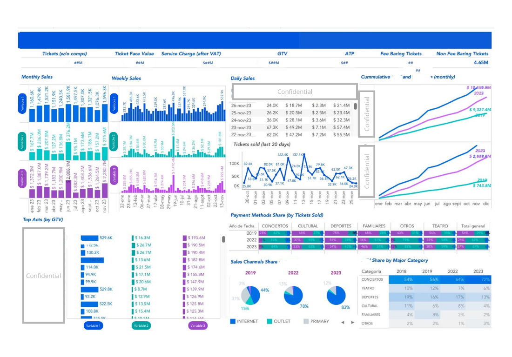
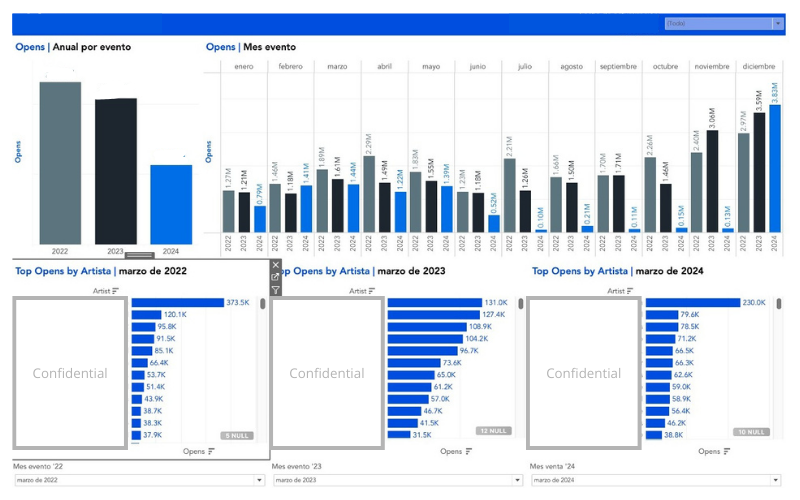
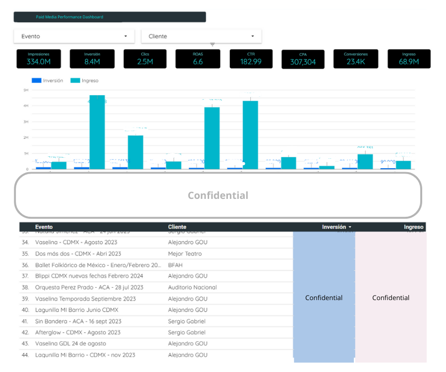

# 📊 Portfolio of Dashboards

This repository showcases selected **dashboards** I have developed as part of my work in Business Intelligence and Data Analytics.  
The dashboards are anonymized but represent **real-world use cases** in sales, marketing, and customer analytics.  

---

## 🎟️ Sales & Revenue Dashboard
**Description:**  
Tracks daily, weekly, and monthly revenue across multiple event categories. Includes KPIs for sales, cumulative analysis, and top performers with share breakdowns from different perspectives.  

**Tools Used:** Tableau · BigQuery · SQL  

**Preview:**  

  

**Description:**  
Year-over-year dashboard comparing general opens (unsold tickets) from different perspectives. Provides monthly and annual breakdowns, along with the Top 20 events or categories.  

**Tools Used:** Tableau · BigQuery · SQL  

**Preview:**  

  

---

## 🌐 Website Traffic Dashboard
**Description:**  
Monitors website performance and user behavior. Includes metrics such as page views, unique visitors, bounce rate, session duration, and traffic sources (organic, paid, social, referral). Helps identify engagement patterns and optimize digital strategy.  

**Tools Used:** Looker Studio · Google Analytics · SQL  

**Preview:**  

  

 

---

## 📈 Marketing Campaign Performance
**Description:**  
Monitors digital campaign performance (email, social, paid ads). Highlights ROI, conversion rates, and channel attribution.  

**Tools Used:** Looker Studio · BigQuery  

**Preview:**  

  

 

---

## 🏟️ Event Attendance & Pricing Analysis
**Description:**  
Provides a deep-dive analysis of attendance and ticket pricing for a major event. Tracks seat occupancy, no-shows, and pricing tiers, with insights into revenue per seat, demand elasticity, and category performance.  

**Tools Used:** Tableau · BigQuery · Python (Pandas)  

**Preview:**  

  

 

---
## 👥 Human Resources Dashboard
**Description:**  
Tracks active workforce metrics including headcount, turnover, department distribution, and employee engagement scores. Supports HR decision-making by highlighting hiring needs, attrition risks, and diversity indicators.  

**Tools Used:** Tableau · Excel · Smartsheet  

**Preview:**  

  

 

---

## 🛠️ Tech Stack
  
  
  
  

---

## ⚡ Note
All data shown is **anonymized and illustrative**. Dashboards are meant to demonstrate **design, analytical skills, and storytelling capabilities**.
